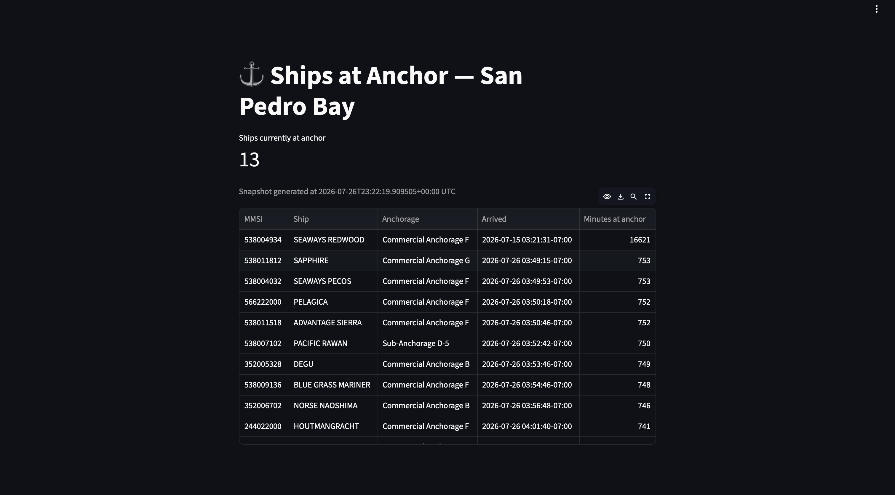

# ⚓ San Pedro Bay Pipeline

A real-time data pipeline that watches every ship in the Port of LA / Long
Beach complex and tells you, right now, which ones are at anchor, moored,
or underway — built and running end-to-end against a live AIS feed, not a
toy demo.

**🔴 Live dashboard:** https://infrared-refined-tribes-zinc.trycloudflare.com
(served off a Cloudflare quick tunnel from the local deployment described
below — the URL is randomly regenerated on every restart, so if it's down
or 404ing, the tunnel has recycled; see the screenshot in
[Usage](#-see-it-in-action) for what it looks like).

## 🌟 Highlights

- **Live, not simulated.** AIS ingestion → Kafka → Spark streaming state
  derivation → Delta lakehouse → dbt → Dagster-orchestrated export →
  Streamlit dashboard, all wired together and running against a real
  vessel-tracking feed.
- **Correctness taken seriously.** A crash-safe state store that doubles
  as the streaming checkpoint, a debounce window tuned to how AIS actually
  reports (not a naive N-observations count), and a validation script that
  checks derived vessel state against AIS's own self-reported status.
- **Cloud deployment: built and correct, not just attempted.** Complete,
  applied Terraform IaC for OCI's Always Free tier (compute, IAM,
  networking, remote state) — ready to run as-is. The only reason it isn't
  the live deployment is OCI never granting capacity for the free-tier
  shape it targets, a resource-availability problem on OCI's side, not a
  gap in the infrastructure code.
- **So the pipeline runs persistently anyway.** A local (launchd)
  deployment stands in for the cloud instance right now — same codebase,
  switched via env var, not a fork — which is what's actually serving the
  live dashboard above.
- **Tested:** `pytest`, 26/26 passing.

## ℹ️ Overview

San Pedro Bay — the water shared by the ports of Los Angeles and Long
Beach — is one of the busiest container-shipping complexes in the world.
This pipeline subscribes to a live AIS (Automatic Identification System)
feed for the bay, streams every position report through Kafka and Spark,
and derives each vessel's real-world state (`AT_ANCHOR` / `MOORED` /
`UNDERWAY`) from its position, speed, and which geofenced zone it's in.
That derived state lands in a Delta lakehouse, gets modeled with dbt, and
is exported by Dagster to a small Streamlit dashboard showing what's at
anchor right now.

It's built by [Rajiv Sai Charan](https://github.com/rajivsaicharan2004) as
an end-to-end demonstration of production-style data engineering
practices — exactly-once stateful streaming, infrastructure as code, and
data-quality validation against an independent signal. It also includes a
complete, applied cloud deployment (Terraform on OCI's Always Free tier)
alongside the local one that's actually live: the IaC is correct and
ready to run, and the only thing standing between it and being the live
deployment is OCI's free-tier capacity availability, not the
implementation — see "Design decisions: infrastructure" below for the
full story.

## 🚀 See it in action

The dashboard shows ships currently at anchor, pulled from a live
snapshot the pipeline exports on a schedule:



To check how well the derived state tracks AIS's own reported status for
a real window of vessel activity:

```
python processing/streaming/validate_state_accuracy.py --hours 24
```

## ⬇️ Running it locally

Requires Python 3.12, Docker, and an [aisstream.io](https://aisstream.io)
API key (free).

```
pip install -r requirements.txt
docker compose up -d                 # Redpanda (Kafka), MinIO (S3), console
echo "AISSTREAM_API_KEY=..." > .env
python schemas/register_schemas.py
./infra/local/setup_local.sh         # producer, streaming jobs, dbt, orchestration & dashboard as launchd services
```

Once running, the dashboard is at `http://localhost:3000` and can also be
run standalone with `streamlit run dashboard/streamlit_app.py`. See
`infra/local/setup_local.sh` and `orchestration/spb_orchestration/` for
what each service does.

## 🧠 Design decisions

**Debounce is time-based (M minutes), not observation-count-based (N
observations).** AIS reporting interval varies enormously with vessel
behavior — as fast as 2s underway, as slow as ~3min at anchor for a Class A
default rate — so "N consecutive observations" would mean a wildly different
real-world duration depending on how the vessel happens to be reporting.
`DEBOUNCE = timedelta(minutes=5)` in `vessel_state_logic.py`: a candidate
state must hold continuously for 5 minutes before it's committed, which is
what stops SOG jitter around the 0.5kn threshold from flapping the derived
state on every position report (`test_sog_jitter_around_threshold_does_not_
flap_state`).

**Derived state is primary truth; AIS-reported status is stored alongside,
not trusted over it.** `VesselState.reported_status` is updated on every
observation, but it never overrides `current_state` — it's compared
against it. Sustained disagreement (`DISCREPANCY_THRESHOLD = 15 minutes`)
raises a `discrepancy_flagged` event; reconciliation raises
`discrepancy_cleared`. The reasoning: `reported_status` is whatever the
vessel's crew set the AIS transponder to, which can be wrong, stale, or
simply not updated — geofence + speed is a physical observation, self-
reported navigational status is not. Ambiguous AIS codes (anything outside
{0, 1, 5, 8} — restricted maneuverability, aground, reserved codes, etc.)
bucket to `OTHER` and are excluded from the comparison entirely rather than
guessed at (`test_ambiguous_nav_status_codes_never_flagged`). This same
design is what `validate_state_accuracy.py` (below) measures the accuracy
of.

**State survives a crash because the state store *is* the checkpoint.**
`vessel_state_job.py`'s `applyInPandasWithState` operator persists every
field of `STATE_SCHEMA` — confirmed state, debounce candidate, discrepancy
timer — to the same checkpoint directory used for Kafka offset tracking,
committed atomically after every micro-batch. A crash mid-batch loses
nothing: on restart, the last committed state-store snapshot comes back
exactly as it was, and the one in-flight (uncommitted) micro-batch replays
deterministically from the last committed offset. This is the same
transactional-commit-plus-checkpointed-offsets property the Delta sinks
(`positions_silver`, `vessel_state_changes`) rely on for exactly-once
writes — one mechanism, covering both the output tables and the stateful
operator's own state.

## ☁️ Design decisions: infrastructure

**Cloud first, then local — not local instead of cloud.** `infra/oci/`
is complete, applied Terraform IaC for OCI's Always Free tier (compute,
IAM, networking, S3-compatible remote state). It was never actually
*running* pipeline workloads on OCI, though: the specific free shape it
targets (`VM.Standard.A1.Flex`, 2 OCPU/12GB) is the most contested
resource in the Always Free pool, and `infra/oci/scripts/retry_apply.sh`
retried against it across multiple multi-day windows without OCI ever
granting capacity. Paying for a non-free shape wasn't the direction taken,
so `infra/local/` stands up the identical pipeline persistently on a Mac
via launchd instead (launchd plists in place of systemd units, a
Cloudflare quick tunnel in place of the OCI security-list-gated public IP,
dbt pointed at a local `dev` target). The two modes share one codebase,
switched via env vars (`DBT_TARGET`/`DBT_VARS`, `SNAPSHOT_OUTPUT_FILE`) —
not a fork. If OCI capacity ever comes through, `infra/oci/` is ready to
`terraform apply` against as-is.

**The A1.Flex capacity constraint is treated as a fact of life, not an
error condition.** `infra/oci/compute.tf` provisions exactly 2 OCPU / 12 GB
of `VM.Standard.A1.Flex` — the current ceiling of OCI's Always Free tier —
because going over it silently stops being free rather than just failing.
The tradeoff is that this specific shape is the most contested resource in
the Always Free pool: `terraform apply` failing with "Out of host capacity"
is the common case, not a config bug, so `infra/oci/scripts/retry_apply.sh`
retries on a fixed interval (default every 10 minutes, up to 8 hours) until
the lottery lands. It's deliberately a script you run yourself, knowingly,
against your own billing account — not a background job invoked
unattended, since `-auto-approve` against a real account for hours at a
stretch is not something to leave unsupervised.

**Terraform's own state lives in the same OCI tenancy it's managing, which
creates a bootstrap problem solved by hand once and then never again.**
The `s3` backend (`infra/oci/providers.tf`) points at OCI Object Storage's
S3-compatible endpoint rather than a native `oci` backend, because
Terraform's OCI provider has never shipped one — the S3-compatible API is
the documented workaround. That bucket can't be created by the same
Terraform run that needs it to store state, so `tf-state`
(`infra/oci/storage.tf`) is created manually in the console first and
brought under management afterward via `terraform import`. The bucket
resource block stays in the config for visibility and drift detection, but
`terraform destroy` on it is a footgun: deleting it out from under an
initialized backend orphans every other resource's state, not just itself.

**The pipeline instance authenticates to Object Storage as itself, not as
a copy of the operator's credentials.** `infra/oci/iam.tf` puts the compute
instance in a dynamic group matched by its own OCID and scopes a policy to
exactly the `san-pedro-bay-lakehouse` bucket — `manage objects` and
`read buckets`, nothing compartment-wide or object-storage-wide. This
means there's no static API key or customer secret key sitting in a config
file on the box for Spark to read; instance principal auth is the
credential, and it can't be exfiltrated by copying a file off the
instance. The same least-privilege instinct shows up one layer down in
`infra/oci/network.tf`: the security list opens SSH and the three app
ports (8080, 9092, 3000) to `my_ip_cidr` alone, with egress left
unrestricted since nothing is gained by locking down apt/docker pulls or
the outbound AISStream websocket.

**The deployment target is a local machine (launchd), not the OCI instance
the rest of this section describes.** OCI's A1.Flex Always Free capacity
never landed after multiple multi-day retry windows, and paying for a
non-free shape (`infra/oci/`'s architecture would otherwise transfer
unchanged — same bucket, same IAM, just a different `compute.tf` shape)
wasn't the direction taken. `infra/local/` runs the identical pipeline
persistently on a Mac instead: launchd plists standing in for the systemd
units, dbt pointed at a `dev` target that reads the docker-compose MinIO
stand-in directly over S3 instead of syncing from OCI via instance
principal, and a Cloudflare quick tunnel standing in for the OCI
security-list-gated public IP. `orchestration/spb_orchestration/assets.py`
and `dashboard_export.py` pick between the two modes via env vars
(`DBT_TARGET`/`DBT_VARS`, `SNAPSHOT_OUTPUT_FILE`) rather than being two
separate codebases. The real tradeoff, not a hidden one: a Mac isn't a
server — it stops if the lid closes, it sleeps, it reboots — durability
the cloud deployment wouldn't have had to think about at all.

**Outstanding: the 24-hour continuous-run validation.** The local launchd
stack is up and currently ingesting live AIS data, but hasn't yet
accumulated a full 24h of continuous runtime — see Validation below for
what's blocked on that and why.

## 🧪 Validation: derived state vs. AIS-reported status

The vessel state machine (`processing/streaming/vessel_state_job.py`) derives
`AT_ANCHOR` / `MOORED` / `UNDERWAY` from position + speed + geofence, debounced
against jitter (`processing/streaming/vessel_state_logic.py`). To measure how
well that tracks reality, `processing/streaming/validate_state_accuracy.py`
compares it against each vessel's own AIS-reported `NavigationalStatus` for a
sample of vessels over a real time window.

**Why AIS-reported status, not a public tracker (MarineTraffic/VesselFinder)
as ground truth:** scraping those sites for real-time vessel status would
violate their ToS — that's specifically what their paid APIs are gated to
sell instead. AIS's own self-reported status is a defensible, already-available,
ToS-safe proxy for the same claim, and it's the same signal the pipeline's live
discrepancy-flagging (`vessel_state_logic.process_observation`) already treats
as worth comparing against.

**Methodology:** for 5 vessels (top-5 by position count in the window, or an
explicit list), every position's `NavigationalStatus` is bucketed into
AT_ANCHOR/MOORED/UNDERWAY/OTHER; `derived_state` at that same instant is
reconstructed via an as-of join against `vessel_state_changes` (exact, not
sampled, since derived_state only changes at a transition event). Rows where
reported status buckets to OTHER (restricted maneuverability, aground,
reserved codes, etc.) are excluded as not comparable to a 3-state model —
same exclusion the live discrepancy flag uses. Full detail in the script's
docstring.

**Status: not yet measured.** This pipeline has not been run continuously for
a real 24-hour window — development happened in short bursts against a live
feed. Running the script now against the data that exists today produces a
functionally-correct but meaningless result (a short window with no captured
anchoring activity, 100% agreement on the trivial all-UNDERWAY case only --
see the script's own caveat output). The number below is a placeholder for a
real run, not a claim:

```
python processing/streaming/validate_state_accuracy.py --hours 24
```

> TODO: run the pipeline continuously for 24h, then paste the script's
> markdown output here in place of this line.

## 💭 Feedback

Spot a bug, have a question about a design decision, or see a way to do
one of the above better? Open an
[issue](https://github.com/rajivsaicharan2004/san-pedro-bay-pipeline/issues) —
feedback is welcome.

## ✍️ Author

[Rajiv Sai Charan](https://github.com/rajivsaicharan2004)
